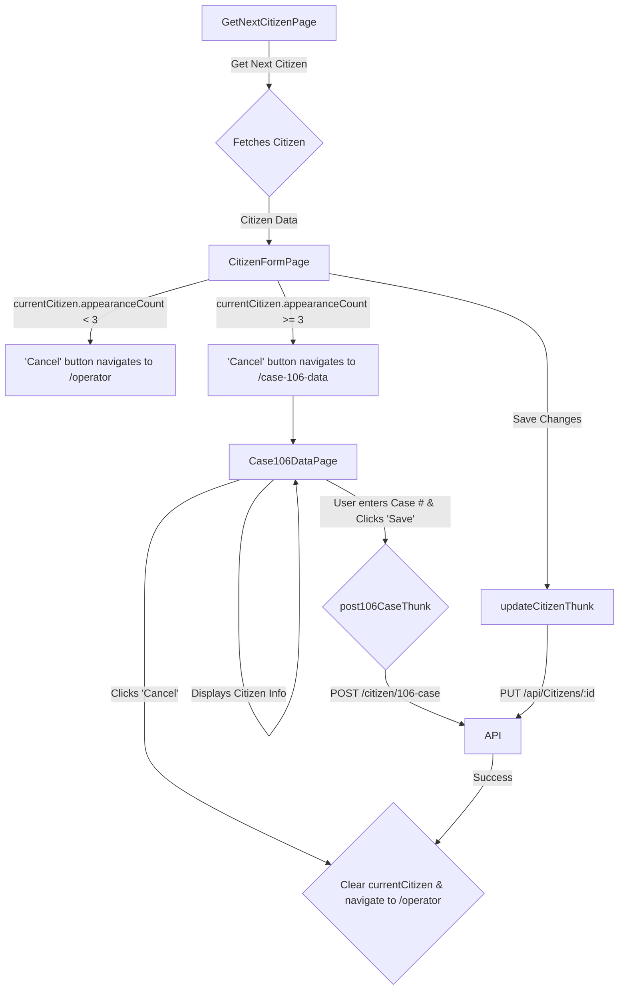

## Context

This document outlines the planned architecture for a new business process for escalating citizen cases. When an operator encounters a citizen who has been unreachable after three or more attempts (as indicated by `appearanceCount >= 3`), they will be guided to a specialized workflow to log a "106 Case" with the municipality and record this action in the system.

## Structure

The solution will introduce a new conditional path in the operator's workflow and a new page component, leveraging the existing Redux state management.

- **`Case106DataPage.tsx` (New Page Component)**: This page will display key citizen information, provide fields for the operator to enter the municipal case number, and handle the submission to the backend. It will be located at the `/case-106-data` route.
- **`CopyableField.tsx` (New Reusable Component)**: A UI component to display a label and value with a "copy to clipboard" button. This will be used extensively on the `Case106DataPage` to improve operator efficiency.
- **`citizensSlice.ts` (Modification)**: This Redux slice will be updated to include a new `post106CaseThunk` for calling the `POST /citizen/106-case` endpoint. The `CitizenResponse` interface will also be updated to match the latest API specification.
- **`CitizenFormPage.tsx` (Modification)**: The "Cancel" button's logic will be modified to conditionally navigate to `/case-106-data` if the citizen's `appearanceCount` is 3 or more.
- **`App.tsx` (Modification)**: A new route definition for `/case-106-data` will be added, protected for operators.

## Behavior

The primary behavior change is the introduction of a new path for operators when a citizen record meets the escalation criteria.

**Workflow Diagram:**

1. On the `CitizenFormPage`, if `currentCitizen.appearanceCount >= 3`, the "Cancel" buttons will navigate the operator to the new `/case-106-data` page.
2. The `Case106DataPage` will display relevant citizen details using the `CopyableField` component.
3. The operator will be prompted to open a case with the "Moked 106" and enter the provided case number into an input field.
4. The input field for the case number will have client-side validation (must be 6 digits). The 'Save' button will be disabled until the input is valid.
5. On 'Save', the `post106CaseThunk` will be dispatched, sending a `POST` request to the `/citizen/106-case` endpoint.
6. On success, the `currentCitizen` will be cleared from the Redux state, and the operator will be navigated back to `/operator` to get the next citizen.

## Evolution

### Planned

— This entire feature is in the planning stage.

### Historical

- v1: Initial design based on the refactoring plan.
