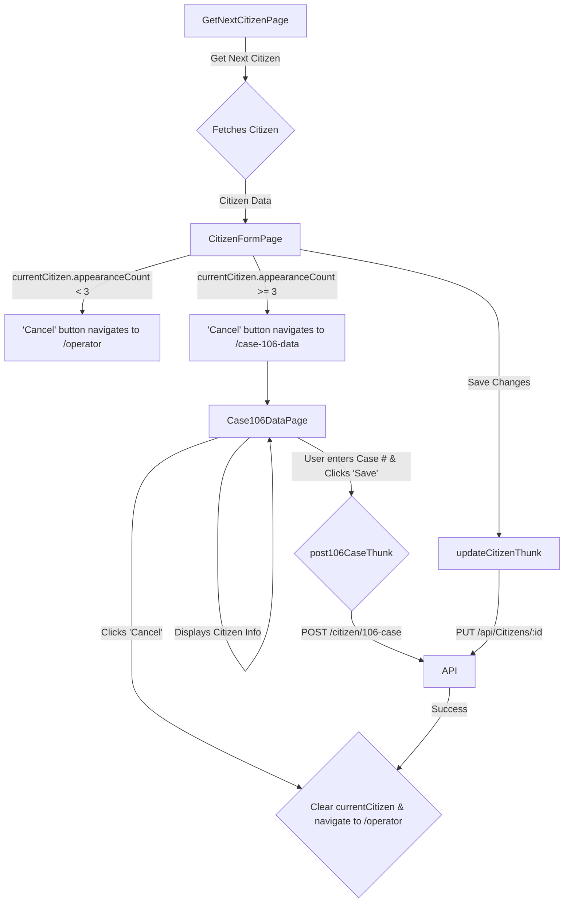

# Refactoring/Design Plan: Implement 106 Case Escalation Workflow

## 1. Executive Summary & Goals

This plan details the implementation of a new business process for escalating citizens who have been unreachable after multiple attempts. When a citizen's record shows three or more appearance counts, the operator will be directed to a new, specialized page to log a "106 Case" with the municipality.

- **Primary Objective:** To create a streamlined workflow for escalating non-responsive citizen cases to the municipal call center (Moked 106) and recording this action in the system.
- **Key Goals:**
  1.  Introduce conditional navigation on the `CitizenFormPage` based on the `appearanceCount` property.
  2.  Create a new `Case106DataPage` to facilitate the collection and submission of escalation details, including input validation and error handling.
  3.  Integrate with the new `POST /citizen/106-case` backend endpoint to persist the escalation record.

## 2. Current Situation Analysis

The current application directs operators from the `GetNextCitizenPage` to the `CitizenFormPage`. On this form, operators can update citizen information and either save the changes or cancel. A "save" or "cancel" action currently returns the operator to the `GetNextCitizenPage` to pull a new record. The `CitizenResponse` data is managed globally for the active session via the `citizensSlice` in Redux. There is no existing mechanism to handle cases requiring escalation after repeated failed contact attempts.

The `CitizenResponse` data model in `src/store/slices/citizensSlice.ts` is outdated and does not match the new Swagger/OpenAPI specification provided, specifically regarding the timestamp field names.

## 3. Proposed Solution / Refactoring Strategy

### 3.1. High-Level Design / Architectural Overview

The proposed solution extends the existing operator workflow by introducing a new conditional path and a corresponding page. The core state management via Redux will be leveraged to ensure data consistency across the workflow.

**Workflow Diagram:**



### 3.2. Key Components / Modules

1.  **`Case106DataPage.tsx` (New Component):** A new page component responsible for displaying relevant citizen data for the 106 case, providing copy-to-clipboard functionality, accepting a case number from the operator with validation, and triggering the submission. It will feature a disabled 'Save' button until input is valid, a 'Cancel' button, and clear error feedback.
2.  **`CopyableField.tsx` (New Component):** A reusable UI component to display a piece of data with a label and a button to copy the data to the clipboard. This will keep `Case106DataPage` clean and DRY.
3.  **`citizensSlice.ts` (Modification):** This Redux slice will be updated to include the new `post106CaseThunk` for calling the escalation endpoint, storing any resulting error message. The `CitizenResponse` interface will also be updated to match the new API schema.
4.  **`CitizenFormPage.tsx` (Modification):** The `handleCancel` logic will be updated to conditionally navigate to the new `/case-106-data` route.
5.  **`App.tsx` (Modification):** A new route definition will be added for `/case-106-data`, protected for operators.

### 3.3. Detailed Action Plan / Phases

#### Phase 1: State Management and API Integration

- **Objective(s):** Align frontend data models with the new API schema and create the necessary Redux actions for the new endpoint.
- **Priority:** High

- **Task 1.1:** Update `CitizenResponse` interface in `src/store/slices/citizensSlice.ts`.

  - **Rationale/Goal:** The current interface has incorrect field names for timestamps (e.g., `FirstAppearanceTimestamp`). These must be updated to camelCase (e.g., `firstAppearanceTimestamp`) to match the provided authoritative Swagger schema and prevent runtime errors when deserializing API responses.
  - **Estimated Effort:** S
  - **Deliverable/Criteria for Completion:** The `CitizenResponse` interface in `citizensSlice.ts` accurately reflects all fields and casings from the new swagger definition.

- **Task 1.2:** Create `post106CaseThunk` in `src/store/slices/citizensSlice.ts`.

  - **Rationale/Goal:** To create an async thunk that encapsulates the logic for making the `POST /citizen/106-case` API call. This keeps API logic consistent and managed within Redux.
  - **Estimated Effort:** M
  - **Deliverable/Criteria for Completion:** A new `createAsyncThunk` named `post106CaseThunk` is implemented. It accepts an object `{ id: number, caseNumber: string }`, calls `api.post('/citizen/106-case', payload)`, and handles pending, fulfilled, and rejected states in the `extraReducers`.

- **Task 1.3:** Update `extraReducers` for `post106CaseThunk`.
  - **Rationale/Goal:** To manage the application's state during and after the API call, providing feedback to the user (loading states) and handling errors.
  - **Estimated Effort:** S
  - **Deliverable/Criteria for Completion:** The `extraReducers` in `citizensSlice` correctly set `loading` to true on pending. On fulfilled, it sets `loading` to false and clears `currentCitizen`. On rejected, it sets `loading` to false and stores the error message from `action.payload` in the `error` state field.

#### Phase 2: UI Implementation

- **Objective(s):** Build the new page and all required UI components for the 106 case workflow.
- **Priority:** High

- **Task 2.1:** Create a reusable `CopyableField.tsx` component.

  - **Rationale/Goal:** To avoid duplicating UI and logic for the numerous "field + copy button" elements required on the new page. This promotes code reuse and maintainability.
  - **Estimated Effort:** M
  - **Deliverable/Criteria for Completion:** A component that accepts a `label` and `value` prop. It should render a `TextField` (read-only) and an `IconButton` with a `ContentCopy` icon. Clicking the button copies the `value` to the clipboard.

- **Task 2.2:** Create the `Case106DataPage.tsx` component file.

  - **Rationale/Goal:** To establish the new page and its structure.
  - **Estimated Effort:** M
  - **Deliverable/Criteria for Completion:** A new file `src/pages/Case106DataPage.tsx` exists. It should render a basic page layout using MUI components. It selects `currentCitizen`, `loading`, and `error` from the Redux store and redirects to `/operator` if `currentCitizen` is `null`.

- **Task 2.3:** Populate `Case106DataPage` with data and controls.

  - **Rationale/Goal:** To implement the full UI as specified in the user task, including the new cancel behavior.
  - **Estimated Effort:** L
  - **Deliverable/Criteria for Completion:**
    - The page uses the `CopyableField` component for `FirstName`, `LastName`, `Phone1`, `email`, `StreetName`, and `BuildingNumber`.
    - The large text area with the pre-formatted, interpolated message and a copy button is implemented.
    - The "open 106 case" button is present and opens the `NAHARIYA_INFO_URL` in a new tab.
    - A "Cancel" button is present. On click, it dispatches `clearCurrentCitizen` and navigates to `/operator`.

- **Task 2.4:** Implement "Save" functionality and validation in `Case106DataPage.tsx`.
  - **Rationale/Goal:** To connect the UI to the Redux action, implement client-side validation, and complete the workflow.
  - **Estimated Effort:** L
  - **Deliverable/Criteria for Completion:**
    - An input `TextField` for the `caseNumber` is present and its value is controlled by component state.
    - Validation logic is implemented for the `caseNumber` field: it must be exactly 6 characters and contain only digits (e.g., using regex `/^\d{6}$/`). An error message is shown on the `TextField` if invalid.
    - The "Save" button is disabled if the `caseNumber` is invalid or if the `loading` state from Redux is true.
    - The "Save" button's `onClick` handler dispatches `post106CaseThunk` with the `currentCitizen.id` and the `caseNumber`.
    - An MUI `<Alert severity="error">` is displayed on the page if the `error` field in the Redux slice is not null.
    - On successful submission (monitored via a `useEffect` hook on the `currentCitizen` becoming null), the user is navigated back to `/operator`.

#### Phase 3: Routing and Workflow Connection

- **Objective(s):** Integrate the new page into the application's routing and update the existing page to trigger the new workflow.
- **Priority:** Medium

- **Task 3.1:** Add the new route to `src/App.tsx`.

  - **Rationale/Goal:** To make the new page accessible via its URL and protect it.
  - **Estimated Effort:** S
  - **Deliverable/Criteria for Completion:** A new `<Route>` for `path="/case-106-data"` is added inside `src/App.tsx`. It renders `Case106DataPage` and is wrapped with `<ProtectedRoute requiredRole={1}>`.

- **Task 3.2:** Modify "Cancel" buttons in `src/pages/CitizenFormPage.tsx`.
  - **Rationale/Goal:** To implement the core trigger for the new workflow.
  - **Estimated Effort:** S
  - **Deliverable/Criteria for Completion:** The `onClick` handlers for both "Cancel" buttons on the page are updated. They check if `currentCitizen.appearanceCount >= 3`. If true, they navigate to `/case-106-data`. If false, they perform the original cancel action (navigating to `/operator`).

### 3.4. Data Model Changes

- **`src/store/slices/citizensSlice.ts`**: The `CitizenResponse` interface will be modified to align with the new Swagger specification.
  - **Change:** Rename `FirstAppearanceTimestamp`, `SecondAppearanceTimestamp`, `ThirdAppearanceTimestamp` to `firstAppearanceTimestamp`, `secondAppearanceTimestamp`, `thirdAppearanceTimestamp`.
  - **Verification:** All other fields in the interface should be cross-referenced with the swagger spec and updated as needed.

### 3.5. API Design / Interface Changes

- **New Frontend-to-Backend API Call:**
  - **Endpoint:** `POST /citizen/106-case`
  - **Request Body:**
    ```json
    {
      "id": "integer",
      "caseNumber": "string"
    }
    ```
  - **Description:** This will be called by the new `post106CaseThunk` action.

## 4. Key Considerations & Risk Mitigation

### 4.1. Technical Risks & Challenges

- **Risk:** State management complexity. If the user uses the browser's back button from `Case106DataPage`, they will land back on `CitizenFormPage`. The explicit "Cancel" button navigating to `/operator` provides a clear exit path.
- **Mitigation:** The current design of locking a citizen to an operator is robust. The new `clearCurrentCitizen` action on cancel/success will correctly release the citizen. The front-end validation on the `caseNumber` field will reduce the likelihood of submitting invalid data to the backend.

### 4.2. Dependencies

- **Internal:**
  - Phase 2 is dependent on the completion of Phase 1 (Redux thunk and updated state).
  - Phase 3 is dependent on the completion of Phase 2 (the new page must exist to be routed to).
- **External:**
  - This plan assumes the backend endpoint `POST /citizen/106-case` is developed, deployed, and available for integration.

### 4.3. Non-Functional Requirements (NFRs) Addressed

- **Usability:** The new workflow is designed to be clear and directive. By providing a dedicated page with pre-filled, copyable data, it reduces the cognitive load on the operator. Immediate validation feedback on the `caseNumber` field and disabling the 'Save' button until the input is valid prevents user errors and improves the user experience.
- **Maintainability:** Creating a reusable `CopyableField` component and encapsulating API logic in a Redux thunk ensures the new code is modular, testable, and easy to maintain.

## 5. Success Metrics / Validation Criteria

- **Success Metric 1:** When an operator handles a citizen with `appearanceCount >= 3`, clicking the "Cancel" button on `CitizenFormPage` successfully navigates them to the `/case-106-data` page.
- **Success Metric 2:** The `Case106DataPage` correctly displays all required information from the `currentCitizen` object. All "copy" buttons function as expected.
- **Success Metric 3:** After entering a valid 6-digit case number and clicking "Save" on the `Case106DataPage`, a `POST` request is successfully sent to `/citizen/106-case`, and the operator is redirected to the `/operator` page.
- **Validation Criteria:**
  - A new record can be seen in the backend database corresponding to the submitted 106 case.
  - The "Save" button on `Case106DataPage` is disabled if the `caseNumber` field is empty or does not contain exactly 6 digits.
  - Clicking the "Cancel" button on `Case106DataPage` clears the active citizen from the Redux state and navigates the user to `/operator`.
  - If the API call fails, an error message is displayed in an `<Alert>` component on the page.

## 6. Assumptions Made

1.  The `currentCitizen` object in the Redux `citizens` slice is the single source of truth for the citizen being processed and is the correct way to pass this data to the new page.
2.  The backend endpoint `POST /citizen/106-case` will be available and will handle the persistence of the 106 case data.
3.  The user role for this entire workflow is "Operator" (role `1`).
4.  The external URL for "Moked 106" is the `NAHARIYA_INFO_URL` constant already present in `CitizenFormPage.tsx`.
