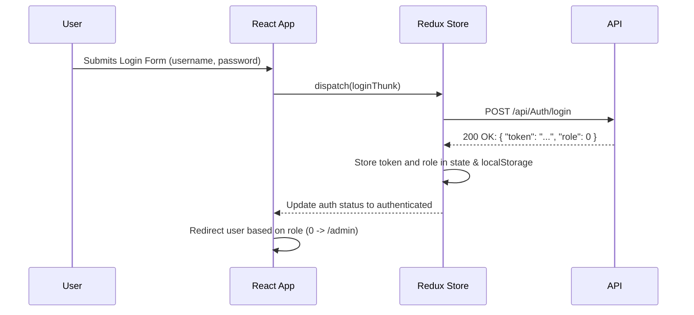

# Design Plan: Hamal Call Center Frontend (Final, Refined)

## 1. Executive Summary & Goals

This document outlines the final, refined design and implementation plan for the "Hamal" call center frontend. This definitive version incorporates all provided clarifications, including specific API response codes for different scenarios. The project will be a minimal-interface React/TypeScript application, adhering strictly to a simple and predictable API contract to ensure maximum development velocity and maintainability.

- **Primary Objective:** To develop a complete and functional frontend application that strictly follows the `design.md` requirements and the detailed `openapi-doc.md`.
- **Key Goals:**
  1.  **Implement Core Workflows:** Enable seamless workflows for 'Admin' (`role: 0`) and 'Operator' (`role: 1`), leveraging a simple authentication process and precise API response handling, including the `204 No Content` status.
  2.  **Establish a Robust Foundation:** Set up a clean, scalable project structure using modern best practices for React, Redux Toolkit, and TypeScript.
  3.  **Maximize Simplicity and Maintainability:** Implement a clear "login on token expiration" policy and simple data-handling patterns based on the well-defined API rules.

## 2. Current Situation Analysis

The project is initialized as a standard Vite + React + TypeScript template.

- **Strengths:** A modern build toolchain is in place. Key dependencies like `react`, `axios`, `react-router-dom`, `react-redux`, `@reduxjs/toolkit`, and `react-hook-form` are already listed in `package.json`.
- **Pain Points / Gaps:**
  - The current code is boilerplate and must be replaced.
  - A proper project structure for a real-world application is missing.
  - **Tailwind CSS**, a required technology, is not yet installed or configured.
  - No application logic is implemented.

## 3. Proposed Solution / Refactoring Strategy

### 3.1. High-Level Design / Architectural Overview

The application will be a Single Page Application (SPA) with a feature-sliced architecture. The entire design is predicated on simplicity, with a one-step authentication process and clearly defined success codes for API interactions.

- **Routing:** `react-router-dom` will manage navigation. Protected routes will guard role-specific pages.
- **State Management:** `Redux Toolkit` will handle the minimal global application state, which consists only of the authentication `token` and user `role`.
- **API Communication:** A centralized `axios` instance will be configured. A request interceptor will attach the auth token. A response interceptor will handle `401 Unauthorized` errors. Async thunks will be built to handle specific success codes: `200 OK` for most operations, and `204 No Content` for the specific case of an empty citizen queue.
- **Styling:** `Tailwind CSS`.
- **Forms:** `react-hook-form`.

The simplified authentication and data flow:

### 3.2. Key Components / Modules

The `src` directory structure remains the same as the previous plan, promoting feature-based organization.

### 3.3. Detailed Action Plan / Phases

#### Phase 1: Project Foundation & Setup

- **Objective(s):** Prepare the project codebase for development.
- **Priority:** High
- _(Tasks 1.1, 1.2, 1.3, and 1.4 remain unchanged from the previous plan.)_

#### Phase 2: Core Services & Authentication

- **Objective(s):** Implement the final, one-step authentication flow.
- **Priority:** High
- _(Tasks 2.1, 2.2, 2.3, and 2.4 remain unchanged from the previous plan, as they are already aligned with the final, simplified specifications.)_

#### Phase 3: Operator Workflow (Refined Logic)

- **Objective(s):** Build the primary workflow for operators with precise API response handling.
- **Priority:** Medium

- **Task 3.1:** Create "Get Next Form" Page.

  - **Rationale/Goal:** Implement the start of the operator's work loop and handle the empty queue scenario.
  - **Estimated Effort:** M
  - **Deliverable/Criteria for Completion:** `GetNextFormPage.tsx` exists. It displays a button to fetch the next citizen. If the `citizensSlice` indicates there are no more citizens (based on the API response), the button is hidden or disabled, and the text `"there are no citizens to call. Thank you for your passion"` is displayed prominently.

- **Task 3.2:** Implement Citizen State Management (`citizensSlice`).

  - **Rationale/Goal:** Manage the state for the citizen form, including the empty queue state.
  - **Estimated Effort:** M
  - **Deliverable/Criteria for Completion:**
    - A `citizensSlice.ts` is created. Its state includes `currentCitizen: CitizenResponse | null` and `queueIsEmpty: boolean`.
    - The async thunk for `GET /api/Citizens/next` is implemented to handle two distinct success cases:
      - If the response status is `200`, it sets `currentCitizen` to the response data and `queueIsEmpty` to `false`.
      - If the response status is `204`, it sets `currentCitizen` to `null` and `queueIsEmpty` to `true`.

- **Task 3.3:** Create the Citizen Form Page.
  - **Rationale/Goal:** Build the data entry form for updating citizen information.
  - **Estimated Effort:** L
  - **Deliverable/Criteria for Completion:** `CitizenFormPage.tsx` is implemented. It reads `currentCitizen` from the store. Its submission thunk expects a `200 OK` on success.

#### Phase 4: Admin Panel (Final Data Handling)

- **Objective(s):** Implement all administrative functionalities.
- **Priority:** Medium
- _(Tasks 4.1 and 4.2 remain unchanged from the previous plan.)_

#### Phase 5: Finalization

- **Objective(s):** Polish the application.
- **Priority:** Low
- _(Tasks 5.1 and 5.2 remain unchanged from the previous plan.)_

## 4. Key Considerations & Risk Mitigation

### 4.1. Technical Risks & Challenges

- The explicit definition of the `204 No Content` response for the empty citizen queue has effectively eliminated the last remaining ambiguity in the API contract. There are no significant technical risks remaining, as the API behavior is now fully specified.

### 4.2. Dependencies

- **Internal:** Phases are sequential. Authentication (Phase 2) is a critical blocker.
- **External:** The plan is fully dependent on the confirmed behavior of the backend API.

### 4.3. Non-Functional Requirements (NFRs) Addressed

- **Simplicity & Maintainability:** The architecture is extremely simple. Clear, distinct success codes for different outcomes (`200` vs. `204`) make the frontend logic more robust and easier to debug than interpreting response bodies.
- **Security:** The JWT is treated as an opaque credential.
- **Usability:** Minimalistic UI, clear loading feedback, and consistent error messages provide a predictable and functional user experience. The specific message for an empty queue greatly improves the operator's experience.

## 5. Success Metrics / Validation Criteria

- **Quantitative:**
  - 100% of the features in `design.md` are implemented.
  - All relevant API endpoints are correctly integrated.
- **Qualitative:**
  - **The "Get Next Form" page, after receiving a `204 No Content` response, correctly displays the text: "there are no citizens to call. Thank you for your passion".**
  - Upon receiving a 401 response, the user is cleanly redirected to the login page.
  - All other successful operations are correctly handled based on a `200 OK` response.

## 6. Assumptions Made

- Most successful API operations (`POST`, `PUT`, `DELETE`, and most `GET`s) will return a `200 OK` status code.
- The `GET /api/Citizens/next` endpoint uses a `204 No Content` status code to unambiguously signal that the queue is empty.
- The role mapping is confirmed: `0` = Admin, `1` = Operator.
- No user-specific data (like username) needs to be displayed in the UI.

## 7. Open Questions / Areas for Further Investigation

- All critical implementation questions have been resolved. The plan is now concrete, fully specified, and actionable.
